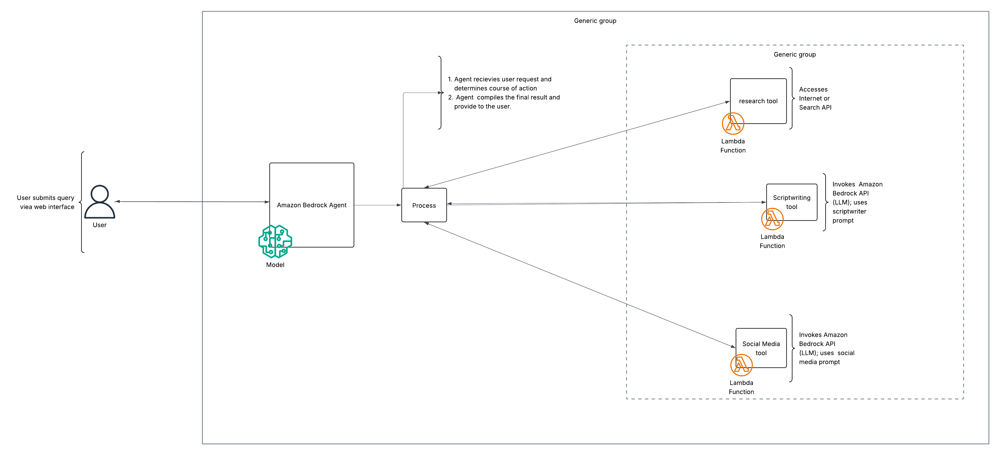

# Creator's Co-Pilot

[](https://opensource.org/licenses/MIT)

An autonomous AI agent that automates the entire content pre-production workflow, from research and scriptwriting to multi-platform social posts.

## The Problem

Content creation is a demanding process. Before a creator can even press record, they face a series of high-friction tasks that consume time and kill creative momentum. These tasks include:

*   **Context Switching:** Constantly moving between notes, browsers, and documents.
*   **The Blank Page:** The initial paralysis of choosing a topic, framing a title, and finding the first few research links.
*   **The Repurposing Grind:** Manually rewriting a core idea for different platforms like Twitter and LinkedIn is tedious and repetitive.

## Our Solution

Creator's Co-Pilot is an autonomous agent built on **Amazon Bedrock**. It takes a single user idea and orchestrates a complete workflow to generate all the necessary pre-production assets. Our agent acts as a creative project manager, freeing up the creator to focus on what humans do best: delivering a compelling performance.

### Key Features

*   **Autonomous Workflow:** Provide a single topic and the agent executes a multi-step plan without further input.
*   **Specialized Tool Use:** The agent uses a set of specialized tools for distinct tasks like web research, scriptwriting, and social media adaptation.
*   **Multi-Platform Output:** Generates a full YouTube script, a promotional Twitter thread, and a professional LinkedIn article from a single source.
*   **Built-in Safety:** Leverages Amazon Bedrock Guardrails to ensure all generated content is safe and appropriate.

## Architecture Overview

This project is built using a **single-agent, multi-tool architecture**.

We use one central **Amazon Bedrock Agent** that acts as the "brain" or orchestrator. This agent has access to a toolbox of specialized **AWS Lambda functions**. It reasons about the user's request, then calls the appropriate tools in a logical sequence to complete the content creation workflow.



## Tech Stack

*   **AI Agent:** Amazon Bedrock Agents
*   **LLMs:** Amazon Bedrock (Anthropic Claude 3)
*   **Backend:** AWS Lambda, Python 3.12
*   **Infrastructure as Code:** AWS SAM
*   **API:** Amazon API Gateway
*   **Python Tooling:** `uv` for package management

## Getting Started

Follow these instructions to get the project running in your own AWS account.

### Prerequisites

*   An AWS account
*   [AWS CLI](https://aws.amazon.com/cli/) configured
*   [AWS SAM CLI](https://docs.aws.amazon.com/serverless-application-model/latest/developerguide/serverless-sam-cli-install.html) installed
*   [Python 3.12+](https://www.python.org/downloads/)
*   [uv](https://github.com/astral-sh/uv) installed (`pip install uv`)

### Installation & Deployment

1.  **Clone the repository:**
    ```bash
    git clone https://github.com/your-username/aws-hackathon-creator-copilot.git
    cd aws-hackathon-creator-copilot
    ```

2.  **Create a virtual environment and install dependencies:**
    This project uses a separate `requirements.txt` for each Lambda function. The AWS SAM CLI will handle this during the build process.

3.  **Build the application:**
    The build command will package all your Lambda functions and their dependencies.
    ```bash
    sam build
    ```

4.  **Deploy to AWS:**
    Deploy the application to your AWS account. The guided flag will walk you through the deployment parameters interactively the first time.
    ```bash
    sam deploy --guided
    ```

## Usage

After a successful deployment, the SAM CLI will output the API Gateway endpoint URL. You can interact with this endpoint using any HTTP client (like Postman or cURL) or by using the provided frontend.

Send a POST request to the endpoint with a JSON body like this:

```json
{
  "topic": "The history of the espresso machine"
}
```

## Repository Structure

- .gitignore
- .LICENSE
- README.md
- template.yaml

- src/tools
    - research
    - scriptwriting
    - social_media

- prompts
- frontend

## License

This project is licensed under the MIT License. See the [LICENSE](LICENSE) file for details.

